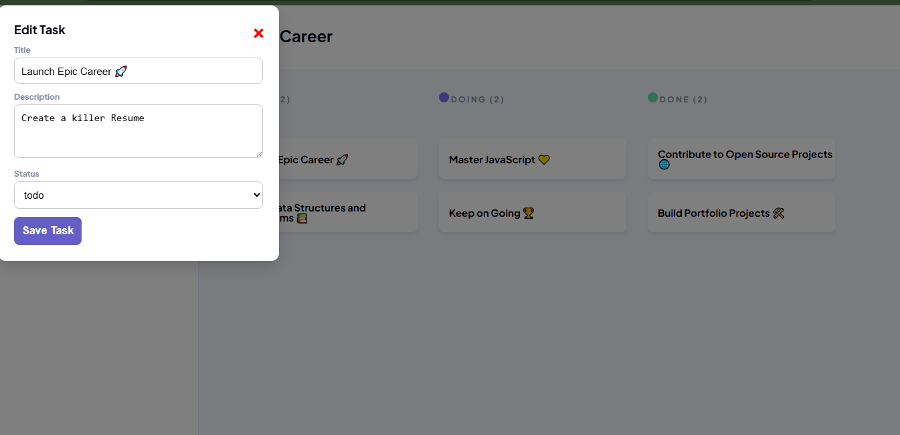
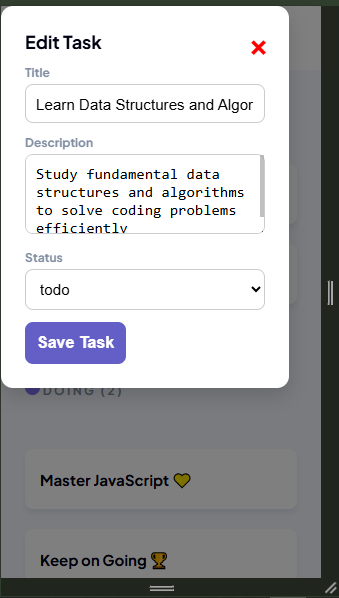

# 🗂️ Kanban Board - Task Management system

 **Kanban Board** system built with **HTML, CSS, and JavaScript**.  
Manages tasks by tracking them across **Todo**, **Doing**, and **Done** columns.  
Supports **editing existing tasks** via a modal interface.  

---

## 📖 Project Description

This project demonstrates a Kanban-style task management system with the following functionality:  
- Display **predefined tasks**. 
- Edit existing tasks through a **modal interface**.  
- Validate task status inputs (`todo`, `doing`, `done`) to prevent incorrect data.  
- Track and display **task counts per column**.  
- Fully **responsive layout** for desktop, tablet, and mobile devices.

---

## 🛠️ Technologies Used

- **HTML5** → Structure of the Kanban board and modal forms  
- **CSS3** → Styling, layout, and responsive design  
- **JavaScript (ES6)** → Dynamic task management, DOM manipulation, event handling  

---

## ✨ Features

### **Features**
- Display **initial tasks** stored in `initialData.js`.  
- Categorize tasks into **Todo, Doing, and Done** columns.  
- Dynamically update **task counts** for each column.  
- Responsive design for desktop, tablet, and mobile.  
- Click on a task card to **edit task details** via a modal.   
- Input validation for task **status**.  
- Close the modal by clicking **close button**.

---

## ⚡ Setup Instructions

### 1. Clone the repository
```bash
git clone https://github.com/Lindokuhle-dumakude/LINDUM25535_FTO2506_GroupB_Lindokuhle_Dumakude_JSL04.git
```

### 🗂️ **2. Open the project folder**

- cd LINDUM25535_FTO2506_GroupB_Lindokuhle_Dumakude_JSL04

### **3. Open in your browser**

- Double-click on index.html

---

## 🕹️ Usage Instructions

1. Open the Kanban Board in your browser.

2. Click a task card to edit it in the modal:

- Update title, description, or status.
- Click Save Task to apply changes.

## 🧩 Output Example

**Initial Tasks Rendered:**:

- **TODO (2)** :

- Launch Epic Career 🚀
- Learn Data Structures and Algorithms 📚

- **DOING (2)** :

- Master JavaScript 💛
- Keep on Going 🏆

- **DONE (2)** :

- Contribute to Open Source Projects 🌐
- Build Portfolio Projects 🛠️

**Editing a task**:

Clicking a task opens a modal.

```bash
Title: Master JavaScript 💛
Description: Get comfortable with the fundamentals
Status: doing

```





---

## 🔮 Future Improvements

- Center the modal to the middle of the page every time it pops up.
- Improve modal response on mobile devices.
